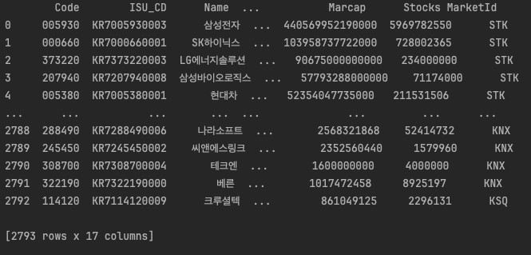
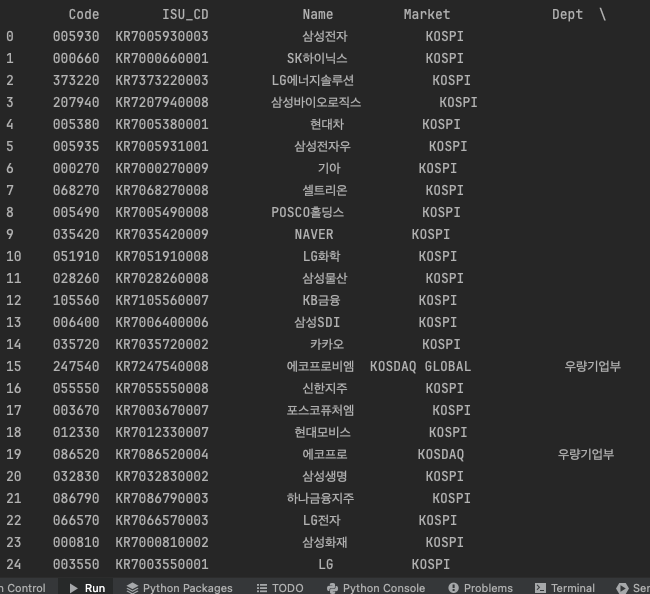

# How to Display the Entire DataFrame Without Truncating Rows and Columns

## 📚 Displaying the Full DataFrame Without Truncation

~~~
pd.set_option('display.max_rows', None)
pd.set_option('display.max_columns', None)
~~~

---

## 📚 Example

~~~
import pandas as pd
import FinanceDataReader as fdr

df_sample = fdr.StockListing('KRX')
print(df_sample)
~~~

Using FinanceDataReader, we fetched the list of stocks listed on the Korea Exchange (KRX).

Because there are many entries, some rows and columns are truncated with `...`.

---

Now, let's set the options to display the entire DataFrame without any truncation.

~~~
import pandas as pd
import FinanceDataReader as fdr

df_sample = fdr.StockListing('KRX')
pd.set_option('display.max_rows', None)
pd.set_option('display.max_columns', None)

print(df_sample)
~~~

Although the output shown here is cropped to fit the screen,  
when you run this code yourself, you will see the full DataFrame without any rows or columns truncated.
