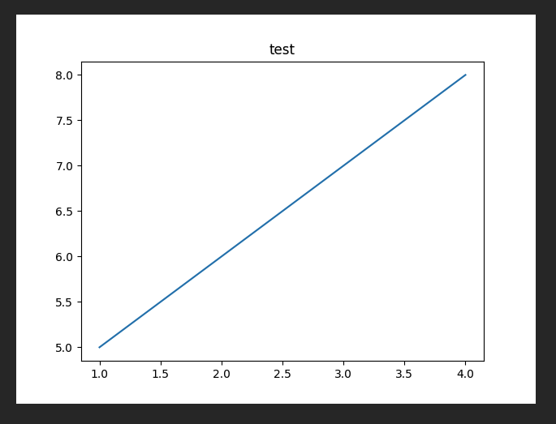
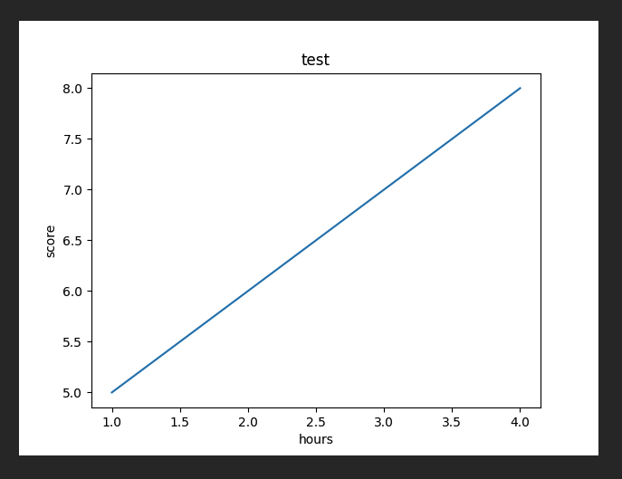
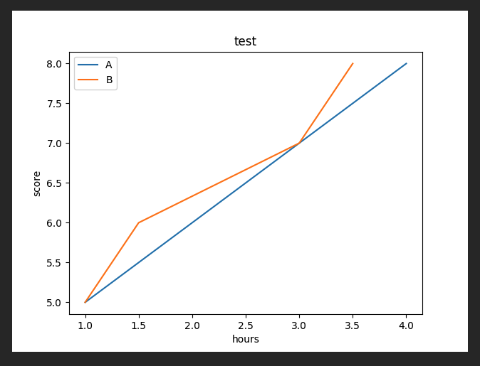

# Installing and Using Matplotlib with Basic Syntax

## 📚 What is Matplotlib?

Matplotlib is a popular Python library used for data visualization.  
It helps you create charts and plots to visually represent data, which is useful for understanding data before analysis or presenting results intuitively after analysis.

---

## 📚 Installation

To use Matplotlib, you first need to install the library.  
You can install it in your Python environment with the following command:

~~~bash
$ pip install matplotlib
~~~

After installation, you can import matplotlib in your Python code and use it.

~~~python
import matplotlib as mpl
print(mpl.__version__)  # Check Matplotlib version
~~~

---

## 📚 Creating a Line Plot

Line plots are useful for visualizing continuous data.

~~~python
import matplotlib.pyplot as plt

plt.title('test')  # Add a title to the plot
plt.plot([1, 2, 3, 4], [5, 6, 7, 8])  # x-axis and y-axis values
plt.show()  # Display the plot
~~~

This code creates a simple line plot using x values [1, 2, 3, 4] and y values [5, 6, 7, 8].

---

## 📚 Adding Axis Labels

Adding axis labels to charts or plots makes the data easier to understand.  
You can use `xlabel()` and `ylabel()` to add labels to the x-axis and y-axis respectively.

~~~python
import matplotlib.pyplot as plt

plt.title('test')  # Plot title
plt.plot([1, 2, 3, 4], [5, 6, 7, 8])  # x-axis and y-axis values
plt.xlabel('hours')  # x-axis label
plt.ylabel('score')  # y-axis label
plt.show()
~~~

This code adds 'hours' as the x-axis label and 'score' as the y-axis label.

---

## 📚 Adding Multiple Lines and Legend

You can add multiple lines to a plot and include a legend to differentiate them.  
For example, draw two lines to compare or add descriptions for each line.

~~~python
import matplotlib.pyplot as plt

plt.title('test')  # Plot title
plt.plot([1, 2, 3, 4], [5, 6, 7, 8])  # First line
plt.plot([1, 1.5, 3, 3.5], [5, 6, 7, 8])  # Second line
plt.xlabel('hours')  # x-axis label
plt.ylabel('score')  # y-axis label
plt.legend(['A', 'B'])  # Add legend
plt.show()
~~~

In this code, the second `plt.plot()` adds a new line, and `plt.legend()` assigns labels 'A' and 'B' to distinguish the two lines.

